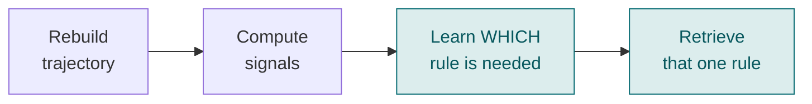
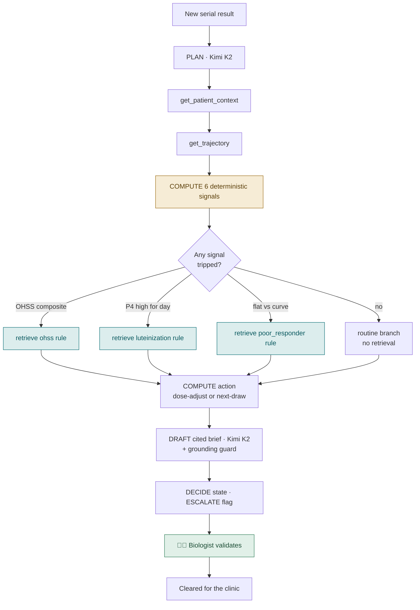
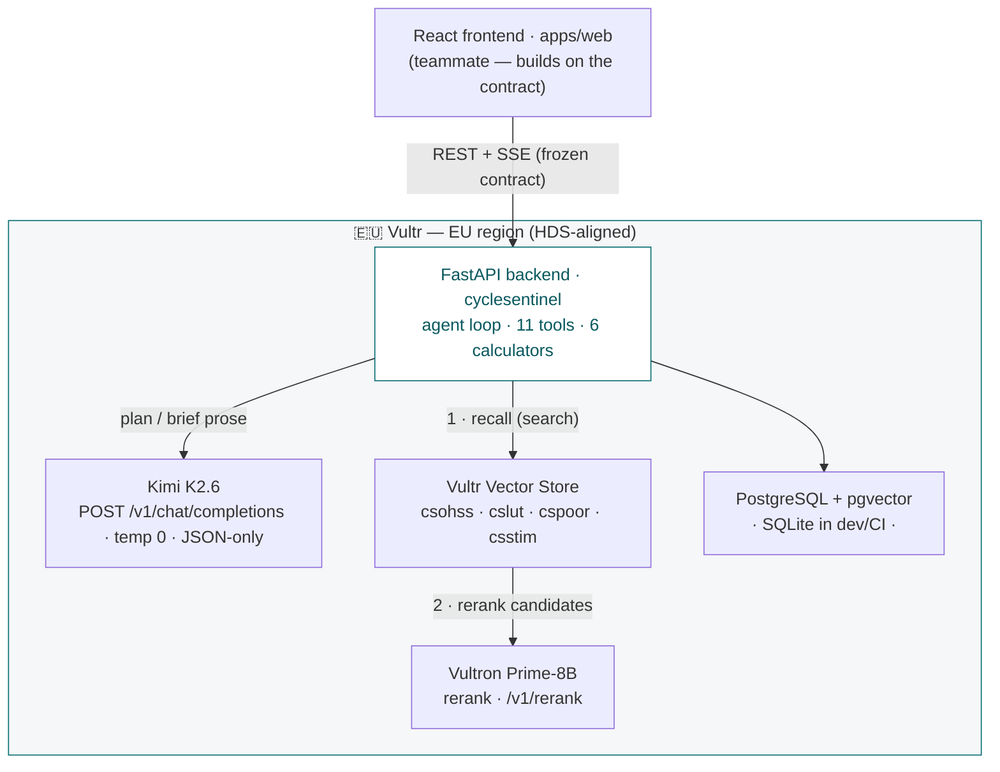

<div align="center">

# 🩺 Cycle Sentinel

### The ovarian-stimulation follow-up that reads the trajectory, **proves** the risk, and **cites** the rule — before the deadline is forgotten.

**An ovarian-stimulation (IVF) monitoring & escalation _agent_ for the lab biologist. Not a chatbot. Not RAG.**

[](docs/PRD.md)
[](docs/architecture.md)
[](#-architecture--sovereign-by-construction)
[](#-architecture--sovereign-by-construction)
[](#-testing--the-hard-harness)
[](apps/api/pyproject.toml)

**▶ [Live demo page](https://claude.ai/code/artifact/28362ef9-d601-4c34-964a-7064de850ebd)** &nbsp;·&nbsp; [Product brief](docs/PRD.md) &nbsp;·&nbsp; [Technical spec](docs/doc.md) &nbsp;·&nbsp; [API contract](docs/CONTRACTS.md) &nbsp;·&nbsp; [Safety](docs/safety.md)

</div>

---

## The problem

During an IVF stimulation cycle, a patient is monitored every 24–48 h with serial hormone draws (estradiol, LH, progesterone) and follicle scans. A clinician writes a follow-up instruction — _"repeat this within 24 h", "watch the progesterone", "she's a high responder"_ — and then the cycle moves fast. Records fragment across the lab system, the scan report and the clinician's note. The single most time-critical complication, **OHSS (Ovarian Hyperstimulation Syndrome)**, announces itself precisely in the trajectory: a steep estradiol rise per day, a high estradiol-per-follicle, PCOS. Miss the window and it becomes an emergency.

The failure mode isn't a lack of data — it's that **nobody rebuilds the trajectory, checks it against the protocol, and raises the flag in time.**

## The idea

For **every new serial result**, Cycle Sentinel:

1. **rebuilds** the patient's hormone trajectory from her fragmented records,
2. runs **deterministic calculators** (rate-of-rise, OHSS composite, progesterone-for-cycle-day, response-curve…),
3. **conditionally** retrieves the *governing* protocol/SOP article — only the one the computation calls for,
4. drafts a **cited monitoring brief** with an **escalation flag**,
5. and hands it to a **human biologist to validate** before anything reaches the clinic.

It answers one operational question — never a clinical one:

> **Is there sufficient documented evidence that the requested follow-up was completed, and if not, what workflow task should staff review next?**

It does **not** diagnose, interpret whether a value is medically abnormal, recommend treatment, or prescribe. The LLM *proposes*; deterministic code *disposes*.

---

## 🧠 Why it's an agent, not RAG

This is the whole thesis. In classic RAG you retrieve first, then answer. Here that's **impossible** — because *which* protocol rule you need is unknown until you've **computed** the signals, which is impossible until you've **rebuilt** the trajectory:



The information-dependency graph **forbids** retrieve-then-answer. Retrieval is a tool the agent calls _because of what it just measured_ — and the **routine patient triggers none at all**. That control case is what makes the killer case's retrievals mean something.

---

## ▶ See it run — the live agent trace

Captured **live** from the running backend against Vultr (Kimi K2.6 + Vultr Vector Store), Patient K — _day 8, antagonist protocol, PCOS_:

```text
[ 1] PLAN (Kimi K2)          6 operational triage steps
[ 2] RETRIEVE patient_context   antagonist · day 8 · AMH 5.8 · AFC 24 · PCOS
[ 3] RETRIEVE trajectory        4 serial draws through cycle day 8
[ 4] COMPUTE  e2_rate           E2 +1600 pg/mL /24h  (+62%/day)
[ 5] COMPUTE  e2_per_follicle   221 pg/mL per mature follicle (19)
[ 6] COMPUTE  ohss_composite    E2 4200>=2700, rate 62>=45, follicles 19>=16   ⚠ TRIPPED
[ 7] COMPUTE  progesterone_for_day   P4 1.60 > day-8 threshold 1.50            ⚠ TRIPPED
[ 8] COMPUTE  response_curve     tracks the expected antagonist curve
[ 9] COMPUTE  monitoring_gap     within the 2-day cadence
[10] 🔀 BRANCH -> ohss           (because ohss_composite tripped)
[11] 📄 RETRIEVE_RULE  ohss_sop §3.1   score 29.35   <- Vector Store recall + Vultron rerank
[12] 🔀 BRANCH -> luteinization  (because P4 tripped for the day)
[13] 📄 RETRIEVE_RULE  luteinization §2.3   score 28.91   <- Vector Store recall + Vultron rerank
[14] ACTION  next_draw_timing    accelerating -> next draw in 24h
[15] 📝 BRIEF drafted (Kimi K2)   dual flag, every clause cited
[16] 🚨 ESCALATE  urgent -> biologist
     ✅ DONE  [OHSS_RISK_ESCALATE, PREMATURE_LUTEINIZATION_FLAG]
```

> **This is genuinely on Vultr.** Each run makes real Vultr Serverless Inference calls (EU region), verified against the live API:
> - `POST /v1/chat/completions` — **Kimi K2.6** plans and writes the brief (temperature 0, JSON-only).
> - `POST /v1/vector_store/{id}/search` — dense recall of the branch's `rule_type` collection.
> - `POST /v1/rerank` — **Vultron Prime-8B** scores the candidate pages and picks the governing article. The `score 29.35` above is a real Vultron relevance score, not a placeholder.
>
> Consumption shows up under **Serverless Inference → Usage** (`GET /v1/usage`), not the Compute/credits page — there is no VM: serverless inference is pay-per-token.

### Same agent, four trajectories

The exact same pipeline produces four different outcomes — and the number of retrievals is **decided by the computation**, not the pipeline:

| Case | Setup | Signals tripped | Conditional retrievals | Final state | Escalation |
|------|-------|-----------------|:---------------------:|-------------|:----------:|
| **K** — killer | Day 8, PCOS, steep E2, borderline P4 | OHSS + luteinization | **2** | `OHSS_RISK_ESCALATE` · `PREMATURE_LUTEINIZATION_FLAG` | 🔴 urgent |
| **R** — routine _(control)_ | Normal curve | none | **0** | `ROUTINE_CONTINUE` | ⚪ none |
| **P** — poor responder | E2 flat vs expected | response-curve | **1** | `POOR_RESPONSE_FLAG` | 🟡 info |
| **M** — missing timepoint | Expected draw absent | monitoring-gap | **0** | `MISSING_TIMEPOINT` | 🟡 info |

> **R retrieves nothing.** Same six computes, zero branches. That's the proof this is an agent, not a threshold-table lookup dressed up as retrieval.

---

## 🔁 The agent loop



**Guarantees:** ≤ 10 steps per run · each conditional rule retrieved at most once · invalid model output retried once against the schema, then routed to `AMBIGUOUS_REQUIRES_REVIEW` · **fail-safe**: anything that should escalate can never resolve to `ROUTINE_CONTINUE`.

### The determinism boundary

| The LLM (Kimi K2) **proposes** | Deterministic code **disposes** |
|--------------------------------|----------------------------------|
| the plan, the interpretation prose | the computed signals (pure Python) |
| which rule to fetch (via the tripped signal) | the escalation flag & decision state |
| the brief's wording | the citation grounding (every quote must resolve to a real page) |

---

## 🏛️ Architecture — sovereign by construction

Hormone data, the protocol corpus, and inference **all stay in an EU region** (HDS-aligned) — the sovereign alternative to sensitive fertility data leaving the EU.



**Three inference modes behind one interface** — the agent loop never learns which is active:

| Mode | LLM + retriever | Use |
|------|-----------------|-----|
| `live` | Vultr — Kimi K2.6 + Vultr Vector Store | the demo |
| `replay` | recorded **cassettes** (content-hashed by request) | CI / tests — deterministic, **never hits the network** |
| `stub` | canned in-code outputs | unit tests |

---

## 🚦 Decision states

| State | Meaning | Typical action |
|-------|---------|----------------|
| `ROUTINE_CONTINUE` | trajectory within expected bounds | continue protocol; standard next draw |
| `OHSS_RISK_ESCALATE` | OHSS composite trips | cite OHSS SOP → coasting / trigger-swap / freeze-all; escalate |
| `PREMATURE_LUTEINIZATION_FLAG` | P4 elevated for this cycle day | cite luteinization rule; escalate |
| `POOR_RESPONSE_FLAG` | response flat vs expected curve | cite poor-responder criteria → dose/plan review |
| `MISSING_TIMEPOINT` | a needed monitoring draw didn't happen | flag the gap; request the missing draw |
| `AMBIGUOUS_REQUIRES_REVIEW` | conflicting / insufficient data or step limit hit | route to biologist — never a silent "normal" |

---

## 🗂️ Repository architecture

Monorepo: **`apps/api`** (this build — Python/FastAPI, package `cyclesentinel`) and **`apps/web`** (React frontend, teammate, builds against the frozen contract). `57` source modules · `45` test modules · `190` tests.

```text
raise-summit-hackathon-2026/
├── README.md                     ← you are here
├── Makefile                      ← install · verify · dev · demo · seed  (the harness)
├── AGENTS.md                     ← conventions + the four hard rules
├── .env.example                  ← live-mode config template (copy → apps/api/.env)
│
├── docs/                         ← the binding specs
│   ├── PRD.md                    ← product brief (the pitch)
│   ├── doc.md                    ← technical spec: loop · tools · calculators · states · data
│   ├── CONTRACTS.md              ← FROZEN REST + SSE + TS contract (the backend↔frontend seam)
│   └── architecture.md · safety.md · demo-script.md · notes.md
│
├── data/synthetic/               ← 100% SYNTHETIC data (the only place content may live)
│   ├── patients.json  results.json       ← the 4 demo cases (K/R/P/M) + serial trajectories
│   ├── thresholds.json  dose_tables.json ← cited numbers (never hardcoded in code)
│   ├── manifest.json             ← ground truth per case (signals · states · citations)
│   └── corpus/<doc>/page-NN.{txt,png,meta.json}   ← 4 protocol/SOP docs, 13 page-indexed pages
│                                    (.txt = text layer the LLM cites · .png = rendered page image)
│
├── scripts/
│   ├── generate_synthetic_data.py   ← `make seed` — regenerates the corpus + demo cases (Pillow)
│   ├── index_corpus.py              ← uploads the corpus into the Vultr Vector Store (per rule_type)
│   ├── record_cassettes.py          ← record (live) / re-key (seed) the replay cassettes
│   └── privacy_scan.py              ← the privacy gate (blocks real PHI / PDFs / secrets)
│
├── .github/workflows/
│   ├── ci.yml                    ← privacy + lint + typecheck + tests (replay, offline)
│   └── smoke-live.yml            ← manual live smoke against Vultr (never on PRs)
│
└── apps/api/                     ← the backend (package `cyclesentinel`, src layout)
    ├── pyproject.toml            ← deps · ruff · mypy --strict · pytest config
    └── src/cyclesentinel/
        ├── main.py               ← FastAPI app factory + lifespan (creates tables, seeds demo)
        ├── config.py             ← Settings (env-driven); defaults = offline/replay
        │
        ├── enums.py              ─┐ THE FROZEN CONTRACT — flat, greppable, byte-matched to CONTRACTS.md
        ├── schemas.py            ─┤ Pydantic models: Patient, HormoneResult, Citation, RetrievalHit,
        ├── events.py             ─┘ ComputedSignal, MonitoringBrief, RunSummary + the 10 SSE AgentEvents
        │
        ├── calculators/          ← 6 PURE functions (no LLM, no IO) → ComputedSignal
        │   ├── e2_rate · e2_per_follicle · ohss_composite
        │   ├── progesterone_for_day · response_curve · next_draw_timing
        │   └── _util.py          ← the Thresholds TypedDict + load_thresholds()
        │
        ├── inference/            ← the mode seam (live | replay | stub) behind two Protocols
        │   ├── base.py           ← LLMClient · VisualRetriever protocols · IdFactory · Clock
        │   ├── live.py           ← Vultr: Kimi K2.6 client + Vector-Store retriever
        │   └── replay.py · stub.py · cassette.py   ← deterministic playback + request keying
        │
        ├── retrieval/            ← the visual-retrieval layer + vector-store abstraction
        │   ├── corpus.py         ← loads the page-indexed corpus (text layer + meta)
        │   ├── collections.py    ← rule_type → Vultr collection id (one per rule_type)
        │   ├── store.py          ← VectorStore protocol + factory
        │   └── vultr_store.py · pgvector_store.py · local_store.py
        │
        ├── tools/                ← the 11-tool registry (Pydantic-validated; model can't call others)
        │   ├── base.py           ← ToolSpec · ToolContext · TOOL_REGISTRY · tool_schemas()
        │   ├── context_tools.py  ← get_patient_context · get_trajectory
        │   ├── compute_tools.py  ← the 5 compute_* tools (wrap the calculators)
        │   ├── retrieval_tool.py ← retrieve_protocol_rule  (the conditional visual retrieval)
        │   ├── dose_tool.py      ← lookup_dose_adjustment
        │   └── brief_tools.py    ← create_monitoring_brief · escalate_to_biologist
        │
        ├── agent/                ← the orchestration
        │   ├── loop.py           ← AgentRunner — emits the AgentEvent trace (+ build_agent_runner)
        │   ├── planner.py        ← the plan turn (JSON-validated, retry-once)
        │   ├── branch.py         ← PURE: tripped signals → which rule_type(s) to retrieve  (not-RAG core)
        │   ├── state.py          ← PURE: decide states, fail-safe, missing-timepoint detection
        │   ├── brief.py          ← draft brief + the GROUNDING GUARD (every citation must resolve)
        │   ├── prompts.py        ← the JSON-strict, safety-scoped LLM prompts
        │   └── jsonio.py · limits.py   ← tolerant JSON extraction · step budget / retry policy
        │
        ├── db/                   ← SQLAlchemy 2.0 (SQLite dev · Postgres+pgvector live)
        │   └── models.py · session.py · repo.py · seed.py
        │
        ├── api/                  ← FastAPI routers (prefix /api)
        │   ├── patients.py · runs.py (SSE) · briefs.py · demo.py · health.py
        │   ├── runner.py         ← drives a run: publish + persist events, save brief, close
        │   ├── bus.py            ← in-process per-run pub/sub for the SSE stream
        │   └── deps.py           ← request-scoped deps + the runner factory seam
        │
        └── tests/                ← the hard harness (see below) + tests/cassettes/{K,R,P,M}/
```

---

## 🚀 Getting started

```bash
make install        # uv sync (fetches Python 3.12 + deps)
make verify         # lint + mypy --strict + tests (replay) + privacy  → the pre-commit gate
make dev            # run the API offline in replay mode (deterministic, no keys needed)
make seed           # regenerate the synthetic corpus + demo cases
```

Hit it:

```bash
curl -s localhost:8000/api/patients                       # the 4 demo patients
curl -s -X POST localhost:8000/api/patients/pat-K/runs    # → { "run_id": "..." }
curl -N  localhost:8000/api/runs/<run_id>/events          # the live SSE agent trace
```

### Going live on Vultr

```bash
cp .env.example .env               # fill VULTR_INFERENCE_API_KEY (ids already set: Kimi K2.6, cs prefix)
python scripts/index_corpus.py     # build the per-rule_type Vector Store collections
make demo                          # run the API in LIVE mode against Vultr (sources ./.env)
```

Model ids are confirmed against `GET /v1/models`: **`moonshotai/Kimi-K2.6`** (LLM) and the **Vultron** retriever family. Retrieval uses one Vector Store collection per `rule_type` (`csohss` / `cslut` / `cspoor` / `csstim`).

---

## 🛡️ Safety & sovereignty — the four hard rules

1. **Synthetic data only.** No real hormone values or identifiers anywhere — enforced by `make privacy` (a required CI gate) + gitleaks.
2. **Internal triage only.** A human biologist validates every brief before it reaches the clinic; the patient is never advised, nothing is auto-sent.
3. **Every recommendation cites a protocol/SOP article.** A **grounding guard** rejects any brief whose citation quote/article doesn't resolve to a real corpus page.
4. **An agent, not RAG.** Trajectory reasoning → computation-driven conditional retrieval → branching escalation. The routine case retrieves nothing.

---

## 🧪 Testing — the hard harness

`make verify` → **190 tests, green, fully offline** (`ruff` + `ruff format` + `mypy --strict` on 57 modules + `pytest -m 'not live'` in replay + privacy gate):

- **Calculators** — each signal against the K/R/P/M ground truth in `manifest.json`.
- **Agent trajectories** — the exact ordered event sequence + final states per case, in **both** replay and stub.
- **The not-RAG invariant** — case R emits zero `branch` / `retrieve_rule`.
- **Full REST + SSE contract** — every endpoint + the frozen `data: <json>\n\n` framing.
- **Contract-drift guard** — Pydantic fields/enums parsed from `CONTRACTS.md` must match.
- **End-to-end** — the real production path (`build_agent_runner`) driven through the app, incl. multi-patient brief persistence.
- **Privacy** — no real PHI / PDFs / secrets in the tracked tree.

CI never calls Vultr; a separate manual `smoke-live.yml` exercises the live path.

---

## 📡 API contract (the frozen seam)

```text
GET  /api/patients                     → Patient[]
GET  /api/patients/{id}/results        → HormoneResult[]        (the trajectory)
GET  /api/patients/{id}/latest-brief   → MonitoringBrief | null
POST /api/patients/{id}/runs           → { run_id }
GET  /api/runs/{run_id}/events         → text/event-stream      (the live agent trace)
POST /api/briefs/{id}/validate|reject  → MonitoringBrief         (human-in-the-loop)
```

Full types + the 10-member SSE `AgentEvent` union in **[`docs/CONTRACTS.md`](docs/CONTRACTS.md)**.

---

<div align="center">
<sub>Built for the RAISE Summit 2026 hackathon · Vultr enterprise-agent track · demo data is 100% synthetic · decision-support for a lab biologist, not a diagnosis.</sub>
</div>
